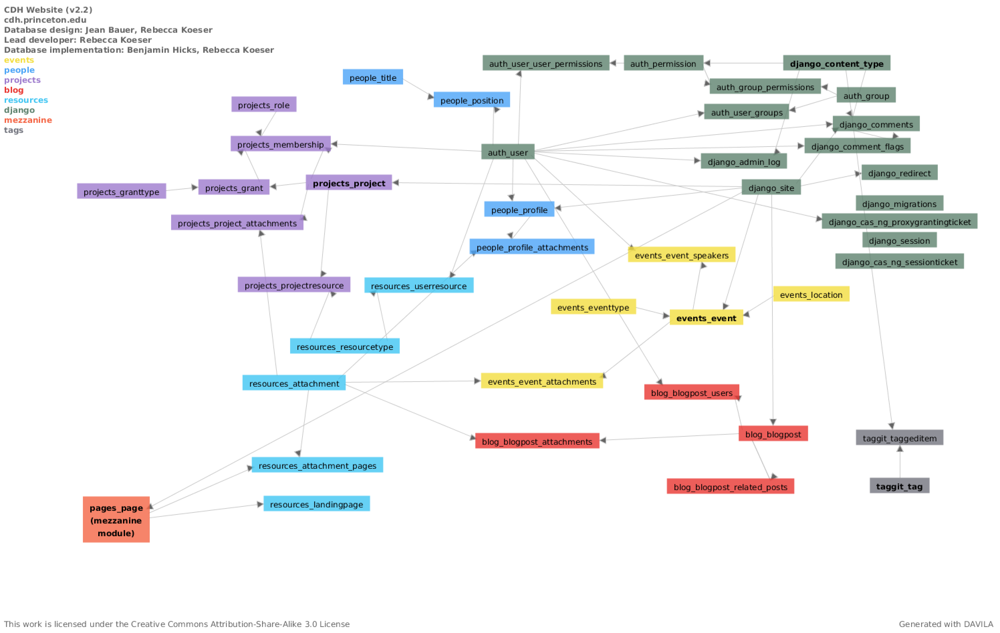
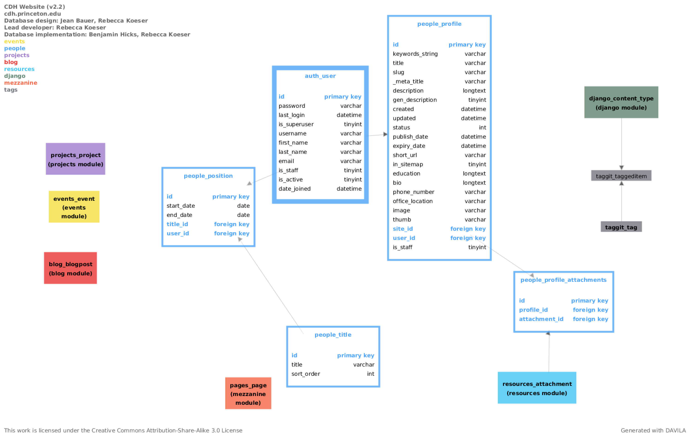
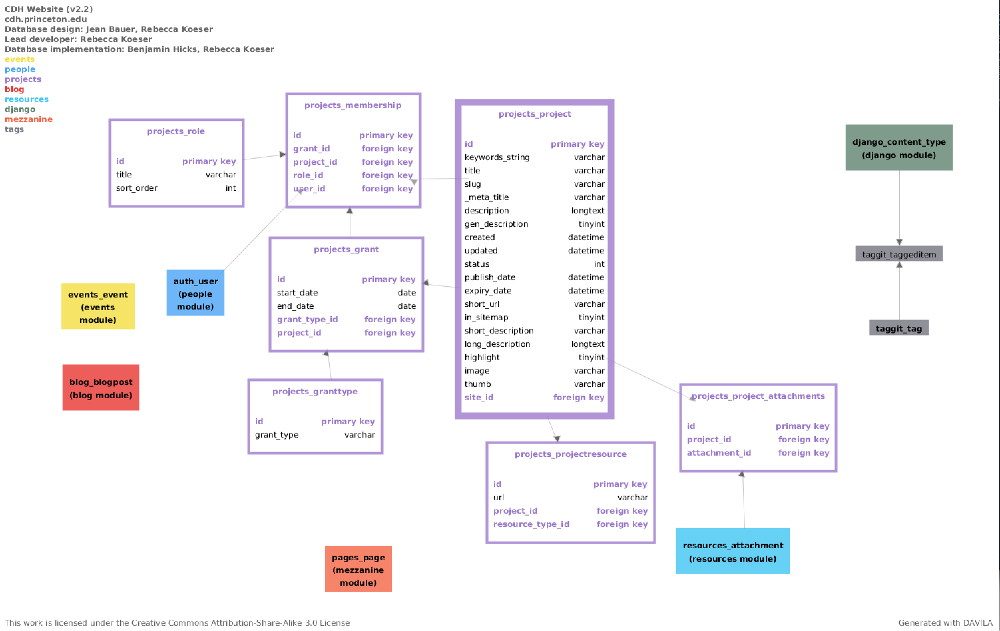
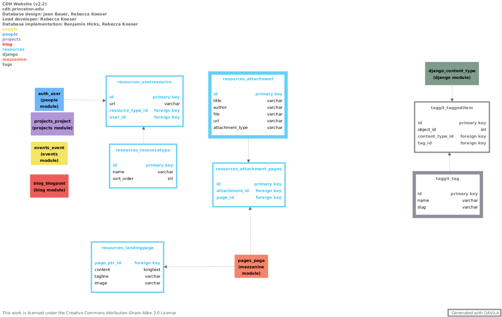

Architecture
============

.. toctree::
   :maxdepth: 2

Database
--------

As of version 2.8.1, `database documentation and diagrams are available via dbdocs <https://dbdocs.io/princetoncdh/cdhweb>`_.

------

Older versions of the database schema as rendered by DAVILA.

Overview
~~~~~~~~

People
~~~~~~

Events
~~~~~~

.. image:: _static/events_detail.png
    :target: _static/events_detail.png
    :alt: Events detail

Projects
~~~~~~~~

Blog
~~~~

.. image:: _static/blog_detail.png
    :target: _static/blog_detail.png
    :alt: Blog detail

Resources
~~~~~~~~~

